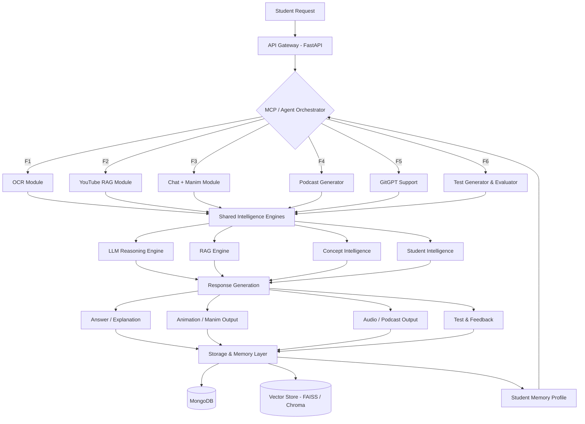

# 🎓 Adyayan AI — Backend

> **AI-Powered Smart Learning Assistant**  
> Helping students truly understand concepts — not just memorize them.

Adyayan AI is an intelligent, personalized learning backend built with **FastAPI**.  
It adapts to each student's thinking level, tracks their learning journey, and provides multimodal, context-aware doubt resolution across text, images, PDFs, and videos.

---

## 🎬 Demo Video


<p align="center">
  <a href="https://www.youtube.com/watch?v=YOUR_VIDEO_ID" target="_blank">
    
  </a>
</p>

<p align="center">
  ▶️ Click to Watch Full Demo
</p>
*(We host demo on YouTube to maintain repository performance.)*

---

## 🏆 Recognition & Achievements

### 📸 Hackathon & Project Highlights

<p align="center">
  
  
  
</p>

<p align="center">
  
  
  
</p>

---

## 🗂️ Table of Contents

- [Features](#-features)
- [Architecture & Flow](#-architecture--flow)
- [Tech Stack](#-tech-stack)
- [Project Structure](#-project-structure)
- [Getting Started](#-getting-started)
- [API Endpoints](#-api-endpoints)
- [Constraints & Mitigations](#-constraints--mitigations)

---

## ✨ Features

| ID | Feature | Description |
|----|---------|-------------|
| **F1** | 🔍 OCR Doubt Detection | Converts handwritten notes/questions into structured digital text and resolves doubts using AI reasoning |
| **F2** | 📺 YouTube RAG | Extracts key concepts from YouTube videos and answers context-aware queries about the video content |
| **F3** | 💬 Chat Mode with Manim | Step-by-step concept-based doubt resolution with auto-generated Manim visual animations for clarity |
| **F4** | 🎙️ Podcast Generation | Converts learning content and explanations into engaging podcast-style audio summaries |
| **F5** | 🤖 GitGPT Support | AI-powered assistant for understanding and navigating codebases and GitHub repositories |
| **F6** | 📝 Test Generation | Auto-generates quizzes and evaluates answers with detailed feedback using semantic and rubric-based scoring |

---

## 🏗️ Architecture & Flow



### Flow Summary

1. **Student Request** — User sends a query via chat, OCR upload, YouTube link, or selects a mode.
2. **API Gateway** — FastAPI receives and validates the request.
3. **Agent Orchestration** — The MCP/Agent Orchestrator identifies the target feature module and manages context.
4. **Intelligence Processing** — Shared engines (LLM, RAG, Concept Intelligence, Student Intelligence) analyze the input.
5. **Response Generation** — Relevant feature modules produce answers, animations, audio, or test papers.
6. **Storage & Memory Update** — Interaction is persisted; student memory and learning profile are updated for future personalization.

---

## 🛠️ Tech Stack

| Layer | Technology |
|-------|-----------|
| **Backend Framework** | FastAPI |
| **AI Models** | OpenAI / Gemini / LLaMA |
| **OCR** | EasyOCR / Tesseract |
| **Speech-to-Text** | Whisper |
| **Vector Database** | FAISS, Chroma, Pinecone |
| **Database** | MongoDB, Supabase |
| **Agent Framework** | LangGraph / MCP |
| **Animation** | Manim |
| **Cloud Storage** | AWS S3 / GCS |

---

## 📁 Project Structure

```
adyayan-ai-backend/
│
├── app/
│   ├── main.py                  # FastAPI entry point
│   ├── core/
│   │   ├── config.py            # Environment & app config
│   │   └── dependencies.py      # Shared dependencies
│   │
│   ├── agents/
│   │   └── orchestrator.py      # MCP / Agent Orchestrator
│   │
│   ├── engines/
│   │   ├── llm_engine.py        # LLM reasoning wrapper
│   │   ├── rag_engine.py        # RAG pipeline
│   │   ├── concept_engine.py    # Concept Intelligence
│   │   └── student_engine.py    # Student Memory & Personalization
│   │
│   ├── features/
│   │   ├── f1_ocr/              # F1: OCR Doubt Detection
│   │   ├── f2_youtube_rag/      # F2: YouTube RAG
│   │   ├── f3_chat_manim/       # F3: Chat Mode + Manim Animations
│   │   ├── f4_podcast/          # F4: Podcast Generation
│   │   ├── f5_gitgpt/           # F5: GitGPT Support
│   │   └── f6_test_gen/         # F6: Test Generation & Evaluation
│   │
│   ├── models/                  # Pydantic schemas
│   ├── db/                      # MongoDB & vector store clients
│   └── utils/                   # Helpers, preprocessors
│
├── tests/                       # Unit & integration tests
├── .env.example
├── requirements.txt
├── Dockerfile
└── README.md
```

---

## 🚀 Getting Started

### Prerequisites

- Python 3.10+
- MongoDB instance
- API keys: OpenAI / Gemini, optionally Pinecone

### Installation

```bash
# Clone the repository
git clone https://github.com/your-org/adyayan-ai-backend.git
cd adyayan-ai-backend

# Create and activate virtual environment
python -m venv venv
source venv/bin/activate  # Windows: venv\Scripts\activate

# Install dependencies
pip install -r requirements.txt

# Copy environment config
cp .env.example .env
# Fill in your API keys and DB URIs in .env
```

### Running the Server

```bash
uvicorn app.main:app --reload --host 0.0.0.0 --port 8000
```

API docs available at: `http://localhost:8000/docs`

---

## 📡 API Endpoints

| Method | Endpoint | Feature | Description |
|--------|----------|---------|-------------|
| `POST` | `/api/f1/ocr` | F1 | Upload handwritten image; returns extracted text + AI explanation |
| `POST` | `/api/f2/youtube` | F2 | Submit YouTube URL + query; returns context-aware answer |
| `POST` | `/api/f3/chat` | F3 | Chat-based doubt solving with optional Manim animation |
| `GET` | `/api/f3/animation/{id}` | F3 | Retrieve generated Manim animation |
| `POST` | `/api/f4/podcast` | F4 | Generate podcast audio from topic or chat content |
| `POST` | `/api/f5/gitgpt` | F5 | Submit GitHub repo URL + query for codebase Q&A |
| `POST` | `/api/f6/test/generate` | F6 | Generate a test from a topic or uploaded content |
| `POST` | `/api/f6/test/evaluate` | F6 | Submit answers for AI-based evaluation and feedback |

---

## ⚠️ Constraints & Mitigations

| Challenge | Mitigation Strategy |
|-----------|-------------------|
| High computational overhead (LLMs, OCR, STT, Manim) | Prompt compression, async batching, response caching |
| End-to-end latency from sequential inference | Non-blocking async APIs, parallel module execution |
| OCR/STT accuracy with noisy handwriting or accents | Robust preprocessing, domain fine-tuning |
| Scalability under concurrent load | Loosely coupled microservices with horizontal scaling |
| Student data privacy | Encryption at rest/transit, RBAC, secure API communication |
| External API dependency (cost, rate limits) | Fallback mechanisms, local model support (LLaMA) |

---

## 🤝 Contributing

Pull requests are welcome! For major changes, please open an issue first to discuss what you'd like to change.

---

## 📄 License

[MIT](LICENSE)

---

<p align="center">Built with ❤️ by Team WeLoveAgents</p>
